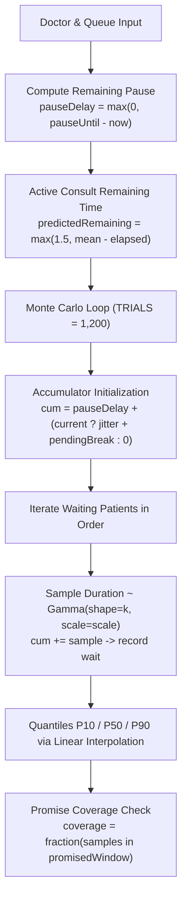

# NirikshaQ — Codebase & Architecture Map

> **Purpose**: This document maps the architecture, forecasting engine, generalised interrupt framework, doctor availability states, state flow, UI components, emergency handling, pace calibration, event sourcing, evaluation benchmarking, and extension seams of **NirikshaQ** — a smart token and wait-time prediction system for government hospital Outpatient Departments (OPD).

---

## 1. Tech Stack, Running the App & Folder Structure

### Tech Stack
- **Framework & Runtime**: React 18+ client-side SPA (no backend or external API dependencies; 100% in-browser simulation).
- **Build Tool**: Vite (`vite`, `@vitejs/plugin-react`).
- **Icons**: `lucide-react` (icons: `Activity`, `AlertTriangle`, `ArrowRight`, `BarChart3`, `Bell`, `Building2`, `CheckCircle2`, `ChevronRight`, `Clock3`, `Code2`, `Coffee`, `Copy`, `Database`, `Download`, `FileText`, `FlaskConical`, `Pause`, `Play`, `Plus`, `RefreshCw`, `RotateCcw`, `ShieldAlert`, `Split`, `Stethoscope`, `Terminal`, `Upload`, `UserPlus`, `Users`, `X`, `Zap`).
- **Styling**: Vanilla CSS ([`src/styles.css`](file:///c:/Users/Vaishnavi/OneDrive/codex%20hackathon/nirikshaQ/src/styles.css)) with CSS Custom Properties (`--bg`, `--panel`, `--panel2`, `--line`, `--text`, `--muted`, `--teal`, `--violet`, `--coral`, `--amber`), CSS Grid & Flexbox, IBM Plex Sans & Space Grotesk via Google Fonts.
- **State Management & Persistence**: Pure Event Sourcing reducer pattern ([`src/state.js`](file:///c:/Users/Vaishnavi/OneDrive/codex%20hackathon/nirikshaQ/src/state.js)) backed by an append-only IndexedDB event store ([`src/db.js`](file:///c:/Users/Vaishnavi/OneDrive/codex%20hackathon/nirikshaQ/src/db.js)).

### How to Run
```bash
# Navigate to project directory
cd nirikshaQ

# Install dependencies
npm install

# Start local Vite development server
npm run dev

# Run automated test suites (Engine, Evaluation, Event Sourcing replay)
npm test

# Build production bundle
npm run build

# Preview production build
npm run preview
```

### Folder Structure
```
nirikshaQ/
├── .gitignore
├── README.md
├── index.html                  # HTML entry point mounting #root to src/main.jsx
├── package.json                # Dependencies, scripts (dev, build, test, preview)
├── package-lock.json
├── src/
│   ├── config.js              # Centralized tunable priors & operational hypotheses (CONFIG, INTERRUPT_TYPES)
│   ├── db.js                  # Lightweight Promise-based IndexedDB event store wrapper
│   ├── engine.js              # Pure forecasting engine (Mulberry32 PRNG, Gamma, EIR, Recovery, Interrupts)
│   ├── evaluator.js           # 30-day synthetic OPD benchmark simulator (Linear vs NirikshaQ)
│   ├── evaluationWorker.js    # Web Worker for non-blocking background Monte Carlo benchmarking
│   ├── state.js               # Pure event sourcing reducer, state rehydration & JSON export/import
│   ├── main.jsx               # React UI components, views, banners, modals, debug overlay
│   └── styles.css             # Theme variables, responsive layouts, modal & chart styles
├── test/
│   ├── engine.test.js         # Forecasting engine, recovery factor, interrupt & EIR unit tests
│   ├── evaluator.test.js      # Evaluation simulation determinism & benchmark invariants test
│   └── events.test.js         # Event sourcing replay determinism, JSON export/import & reset tests
└── docs/
    └── CODEBASE_MAP.md        # Comprehensive architecture & codebase reference (this file)
```

---

## 2. Generalised Interrupt Framework & Doctor Availability

NirikshaQ generalises "emergencies" into a unified **Interrupt Architecture**. Every disruption (emergency insertion, doctor called to ward, doctor taking a break, second doctor opening / queue split) reuses the exact same core pipeline:
1. Monte Carlo distribution sampling ($1,200$ trials)
2. Post-interrupt recovery factor ($\alpha = 0.15, \lambda = 20\text{ min}$)
3. Promise-coverage Emergency Impact Radius (EIR) threshold ($0.35$)
4. Single-line debug HUD and alert banners with `role="alert"`
5. Leave-By time recalculated with explicit human-readable reasons

### Interrupt Types ([`src/config.js`](file:///c:/Users/Vaishnavi/OneDrive/codex%20hackathon/nirikshaQ/src/config.js))

| Interrupt Type | Trigger & Mechanics | Ongoing Consult Policy | Recovery Factor |
| :--- | :--- | :--- | :--- |
| `EMERGENCY_INSERT` | Emergency patient registered/escalated | **Never interrupted** (inserted at `max(consultIdx+1, 0)`) | Active immediately for 20 min |
| `CALLED_TO_WARD` | Doctor leaves for $N$ min (default 15) | Consult paused mid-way, resumes upon return | Applied after doctor returns |
| `BREAK` | Doctor takes $N$ min break (default 10) | **Waits until active consult finishes** | Applied after break ends |
| `SECOND_DOCTOR_OPENS` | Reassigns alternating waiting patients | Active consult is **never moved** | Calculated per doctor queue |
| `DOCTOR_RETURNS` | Doctor returns early / pause expires | Resumes paused consult or starts next | Applies recovery speedup |

### Doctor Object Data Model
```javascript
{
  id: 'd1',                         // Doctor ID (e.g. 'd1', or uid())
  name: 'Dr. Meera Joshi',          // Doctor display name
  specialty: 'General Medicine',    // Medical department
  baseAvgMin: 8,                    // Baseline consultation time in minutes
  paceMultiplier: 1.0,              // Dynamic EWMA speed multiplier (1.0 = baseline)
  availability: 'available',        // 'available' | 'in_consult' | 'ward_call' | 'break'
  pauseUntil: 1716300900000,        // Timestamp when current pause expires (or null)
  pauseTotalMin: 15,                // Total pause duration in minutes
  pendingBreakMin: null,            // Scheduled break minutes awaiting active consult completion
  lastEmergencyAt: null,            // Legacy emergency timestamp
  lastInterruptAt: 1716300000000,   // Timestamp of last interrupt (recovery boost trigger)
  queue: Array<Patient>             // Ordered list of assigned patients
}
```

### Patient Object Data Model
```javascript
{
  id: 'a8f92b1',                    // Unique random string from uid()
  token: '001',                     // 3-digit padded token number
  name: 'Sunita Patil',             // Patient name or 'Anonymous patient'
  severity: 'routine',              // 'routine' | 'urgent' | 'emergency'
  status: 'waiting',                // 'waiting' | 'consult' | 'done'
  createdAt: 1716300000000,         // Timestamp of registration
  emergency: false,                 // Boolean flag for emergency priority
  forecastEpoch: 1,                 // Revision count incremented on affected re-forecast
  promisedWindow: {                 // Initial / last communicated arrival window
    p10: 10, p50: 16, p90: 24,
    low: '10:10 AM', at: '10:16 AM', high: '10:24 AM'
  },
  leaveByReason: 'Doctor called to ward', // Reason note when leave-by shifts >5 min
  consultStartedAt: 1716300120000,  // Present when status === 'consult'
  completedAt: 1716300600000,       // Present when status === 'done'
  actualDuration: 8.0               // Recorded duration in minutes when status === 'done'
}
```

---

## 3. The Forecasting Engine & Interrupt Evaluation

The pure forecasting engine lives in [`src/engine.js`](file:///c:/Users/Vaishnavi/OneDrive/codex%20hackathon/nirikshaQ/src/engine.js).



### Key Functions & File Locations

| Function | File & Lines | Description |
| :--- | :--- | :--- |
| `createPRNG(seed)` | [`src/engine.js`](file:///c:/Users/Vaishnavi/OneDrive/codex%20hackathon/nirikshaQ/src/engine.js) | Seedable 32-bit Mulberry32 pseudo-random number generator |
| `gammaSample(k, scale, prng)` | [`src/engine.js`](file:///c:/Users/Vaishnavi/OneDrive/codex%20hackathon/nirikshaQ/src/engine.js) | Marsaglia–Tsang (2000) Gamma sampler using PRNG |
| `calculateRecoveryFactor(lastInterruptAt, now)` | [`src/engine.js`](file:///c:/Users/Vaishnavi/OneDrive/codex%20hackathon/nirikshaQ/src/engine.js) | Computes $1 + \alpha \cdot e^{-\Delta t / \lambda}$ temporary throughput speedup |
| `forecastDoctor(doc, queue, now, options)` | [`src/engine.js`](file:///c:/Users/Vaishnavi/OneDrive/codex%20hackathon/nirikshaQ/src/engine.js) | Runs 1,200 Monte Carlo trials per doctor, accounting for pauses and breaks |
| `evaluateInterruptImpact(params)` | [`src/engine.js`](file:///c:/Users/Vaishnavi/OneDrive/codex%20hackathon/nirikshaQ/src/engine.js) | Re-forecasts downstream queue and computes promise coverage $< 0.35$ |
| `calculateLeaveByTime(forecast, travelBufferMin)` | [`src/engine.js`](file:///c:/Users/Vaishnavi/OneDrive/codex%20hackathon/nirikshaQ/src/engine.js) | Computes recommended departure time based on P10 arrival window |
| `getInterruptReason(type, extra)` | [`src/engine.js`](file:///c:/Users/Vaishnavi/OneDrive/codex%20hackathon/nirikshaQ/src/engine.js) | Generates clear explanation string for wait/leave-by shifts |

---

## 4. Append-Only Event Sourcing & IndexedDB Persistence

To survive page refreshes mid-interrupt without loss of pause state, remaining timer, or moved patients, NirikshaQ uses an **append-only event store** in IndexedDB.

### Supported Event Types ([`src/state.js`](file:///c:/Users/Vaishnavi/OneDrive/codex%20hackathon/nirikshaQ/src/state.js))
1. `SYSTEM_INIT`: Baseline system initialization with initial doctor profiles and root simulation seed.
2. `PATIENT_REGISTERED`: Patient registered with doctor, initial promised window, and epoch.
3. `PATIENT_ESCALATED`: Patient escalated to immediate post-consult emergency priority.
4. `DOCTOR_CALLED_TO_WARD`: Doctor leaves for ward call; ongoing consult paused.
5. `DOCTOR_BREAK_STARTED`: Doctor takes a break (immediate if idle, or queued until active consult finishes).
6. `DOCTOR_RETURNED`: Doctor ends pause early / returns to active consulting; triggers recovery factor.
7. `QUEUE_SPLIT`: Waiting patients reassigned to second doctor; both queues re-forecasted.
8. `CONSULT_STARTED`: Doctor begins consultation with the next waiting patient.
9. `CONSULT_COMPLETED`: Doctor finishes consultation with actual duration in minutes, updating EWMA pace multiplier (and transitioning to queued break if scheduled).
10. `DOCTOR_ADDED`: New doctor profile added with baseline consultation minutes and empty queue.
11. `BANNER_DISMISSED`: Alert banner dismissed.
12. `DEMO_RESET`: Clears event log in IndexedDB and resets hospital state back to baseline.

---

## 5. UI Views & Interrupt Experience

### 1. Queue Board (`view === 'board'`)
- **Interrupt Banner**:
  - `EMERGENCY_INSERT`: Red clinical styling with critical priority badge.
  - `CALLED_TO_WARD` / `BREAK` / `SECOND_DOCTOR_OPENS`: Amber clinical styling with live remaining countdown.
- **Doctor Card Header**: Shows status badge e.g. `"In Ward (back in 12:45)"` or `"On Break (back in 08:30)"`.
- **Patient Rows**: Displays P10–P90 arrival windows, median time, Leave-By time, and interrupt reason notes (`"Doctor called to ward"`, `"Doctor on break"`, `"Moved to Dr. Rao"`).

### 2. Nurse Station (`view === 'nurse'`)
- Register Routine, Urgent, or Emergency patients.
- Escalate waiting patients to immediate next.
- **Split Queue Modal**: Select source doctor, transfer doctor, and customize patient reassignment with alternating checkboxes.

### 3. Doctor Panel (`view === 'doctor'`)
- **Doctor Status Tabs**: Live status tags (`Available`, `In consult`, `Ward (mm:ss)`, `Break (mm:ss)`).
- **Interrupt Action Controls**:
  - Duration input (e.g. 15 min).
  - `"Called to ward"`: pauses doctor immediately.
  - `"Take a break"`: schedules break after active consult.
  - `"Return & Resume"`: ends pause early.
  - `"Split queue"`: opens second doctor split workflow.
- Consult completion with actual duration entry and live EWMA pace recalibration.

### 4. Evaluation Lab (`view === 'eval'`)
- 30-day Monte Carlo simulation in Web Worker comparing Linear Baseline vs NirikshaQ Engine.
- Side-by-side error metrics, calibration comparison, visual bar charts, and CSV export.

### 5. Debug Overlay (Toggle with 'D')
- HUD summary:
  `CALLED_TO_WARD | injected delay 15 min | recovery +12% | affected 6 | unaffected 9`
- Downstream promise coverage table with `AFFECTED` and `UNAFFECTED` status badges.
